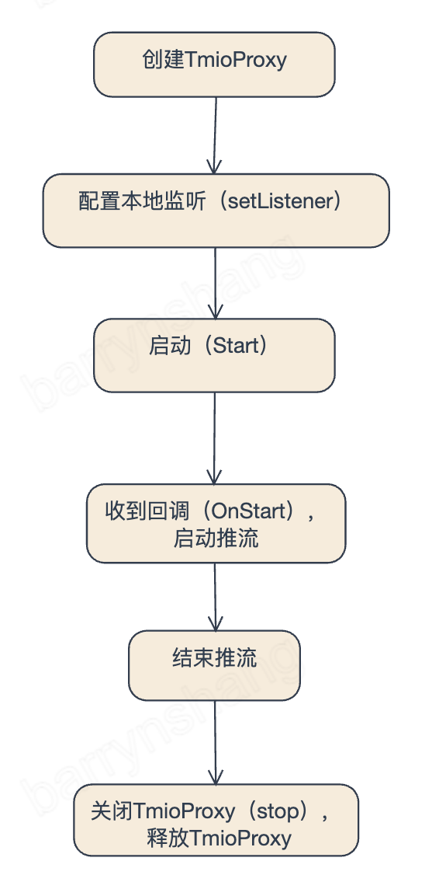

# Tmio Proxy 接入接口说明

### 基本使用流程

*  

1. 创建TmioProxy
2. 配置监听`void setListener(TmioProxyListener *listener)`
3. 启动`std::error_code start(const std::string &local_url, const std::string &remote_url, void * config=nullptr)`
4. 收到回调`onStart(const char *local_addr, uint16_t local_port)`，启动RTMP推流到本地`rtmp://${local_addr}:${local_port}/${app}/${stream}?{query}`
5. RTMP结束推流
6. 关闭TmioProxy `void stop()`，释放TmioProxy


__说明__

* **使用腾讯云，RTMP URL query添加一个字段txHost=${server_domain}，例如：**

  `rtmp://127.0.0.1:8888/live/test?txSecret=***&txTime=***&txHost=livepush.myqcloud.com`

  **原因是RTMP server对tcURL有鉴权。tcURL默认从URL构造（FFmpeg和librtmp均可通过参数配置tcURL），例如上面的URL生成的tcURL为rtmp://127.0.0.1:8888/live/test。服务器检查tcURL不等于服务器域名，鉴权失败。txHost可覆盖对tcURL的鉴权，见**

  [腾讯云HttpDNS 调度](https://cloud.tencent.com/document/product/267/36164)

* TmioProxy和推流客户端是一对一的关系，不支持一对多，不支持重用（stop后再start）

* 可以创建多个TmioProxy实例

* TmioProxy内部没有超时重连机制。TmioProxy start时会与远程服务器建立连接，如果远程服务器有超时机制，而客户端没有及时向TmioProxy推流，会出现超时失败（onError回调）。客户端可以重建TmioProxy再推流

  

------

### 创建TmioProxy

```c++
    static TmioProxy *create();

    static std::unique_ptr<TmioProxy> createUnique();
```

----

### 设置监听

```c++
void setListener(TmioProxyListener *listener);
```

TmioProxyListener监听接口如下：

1. Tmio配置回调，用户可在此回调内对Tmio做参数配置，**简单配置可使用`tmio-preset.h`提供的辅助方法**。

   ```c++
   void onTmioConfig(Tmio *tmio);
   ```

2. TmioProxy启动回调：

   ```c++
   void onStart(const char *local_addr, uint16_t local_port);
   ```

   收到此回调代表连接远程服务器成功，并且TCP本地端口绑定成功，可以启动推流。

3. 错误信息回调

   ```c++
   void onError(ErrorType type, const std::error_code &err);
   ```

   用户可通过`ErrorType`来区分是本地IO错误还是远程IO错误。本地IO通常是RTMP推流主动触发的，如结束推流，一般可忽略，而远程IO错误一般不可忽略。

-----------

### 启动代理

```c++
std::error_code start(const std::string &local_url, const std::string &remote_url, void * config=nullptr)
```

* `local_url`只支持tcp scheme，格式`tcp://${ip}:${port}`。port可以为0，为0时会绑定到随机端口，然后通过onStart()回调把绑定成功后的端口号返回给应用。使用0端口可以避免端口被占用、无权限等导致的绑定失败问题。
* `remote_url`远程服务器url
* `config` 配置参数，此参数当前仅支持在SRT BONDING 功能启用时使用，具体定义详见[SRT Bonding Config](tmio-feature.md#SRT%20Bonding%20Config%20(Group))

----

### 停止

```c++
void stop();
```
----