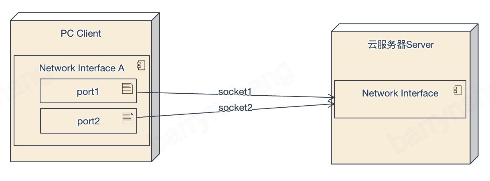

## Tmio Bonding 集成说明

- Bonding 是什么？
    * Bonding 功能使用group的概念，即绑定多个socket的实体，需要建立“绑定连接”，与server端建立多个socket链接（可使用多端口或多网卡等模式），同时将多个socket链接绑定到一个组内。
    * 只要至少有一个成员套接字连接处于活动状态，一个组就会被连接。只要一个组处于连接状态，一些成员连接可能会断开，并且可以建立新的成员连接。

- Bonding 支持的模式
    * broadcast - 即广播发送，数据通过每一条链路发送一份数据
    * backup - 备份模式，即在主链接状态良好的情况下，一个或多个备份连接处于待机状态，只有当主链接网络状况变差的情况下，这些备份链接就会被激活来保证数据流的活跃和稳定性。

----

### Bonding 拓扑结构

   |              单网卡多port bonding 拓扑结构                |
   | :----------------------------------------------------: |
   |  |


   |              多网卡 bonding 拓扑结构                |
   | :----------------------------------------------------: |
   |  |


----

### SRT Bonding 配置说明
----
- SRT Protocol
    ```C++
    enum class Protocol {
        TCP,  // only for test, should not be used
        SRT,
        RIST,
    };
    ```

- SRT Trans Mode
    ```C++
    enum class SrtTransMode {
        SRT_TRANS_DEFAULT = 0,
        SRT_TRANS_BROADCAST,
        SRT_TRANS_BACKUP,
        SRT_TRANS_BALANCING,
        SRT_TRANS_MULTICAST,
        SRT_TRANS_UNDEFINE,
    };
    ```
    * `SRT_TRANS_DEFAULT`： 默认不使用bonding功能(单链路传输)
    * `SRT_TRANS_BROADCAST`： 广播模式(根据配置的网卡数量建立连接), 每一个数据包都通过每一条链接发送一份
    * `SRT_TRANS_BACKUP`：主备模式(根据配置的网卡数量建立连接), 使用一条socket链接发送数据，其他链接作为备用一直处于idle状态定时发送keeplive，当active链路出现丢包或长时间无响应等异常时，从idle状态集中激活一条链路使用
    * `SRT_TRANS_BALANCING`： 暂不支持
    * `SRT_TRANS_MULTICAST`： 暂不支持
    * `SRT_TRANS_UNDEFINE`： 未定义

----

- SRT_NetCardOption
    ```C++
    struct NetCardOption{
        // Network card name, Used to specify the network card to send and receive
        // ifreq.ifr_name. eg:eth0/en0
        // Temporarily unused
        std::string netcard;

        // netcard ip address，used to bind udp client
        std::string ipaddr;

        // remote url，If the server has multiple network card addresses, this can be configured
        std::string remote_url;

        // local udp client bind port
        int local_port;

        //Weight, priority range【0-100】
        int weight;

        // udp socket id, if the value is not INVALID_SOCKET_VALUE, dup it to use
        // In order to adapt to the problem that the android system cannot use the data network after wifi is enabled,
        // the upper layer needs to do the bind operation
        int socket_id;
    };
    ```
    - NetCardOption 结构解析

        * netcard - 网卡名称，当前主要为回调通知链路异常断开时方便用户知道哪个网卡异常
        * ipaddr - 链路传输绑定的网卡地址，建议使用真实地址，不要使用（0.0.0.0）
        * remote_url - 远端服务侧地址
        * local_port - 本地绑定端口，默认系统随机分配
        * weight - 链路权重
        * socket_id - 上层应用创建的socket id， sdk会复制它，需上层应用自己释放`（对于proxy模式需要在调用start后，接收到回调通知onStart或onError后方可释放）`

--------------

- SRT Bonding Config (Group)

    ```c++
    enum class NotifyType {
        NOTIFY_LINK_BROKEN = 1,
    };

    using NotifyCallback = std::function<void(NotifyType, void *)>;

    struct TMIO_EXTERN SrtFeatureConfig {
        // The proxy judges which protocol to use according to the protocol,
        // and the first member variable of the new config must be protocol.
        Protocol protocol;
        SrtTransMode trans_mode;

        // NotifyType type        |    void *info
        // -----------------------------------------------------------
        // NOTIFY_LINK_BROKEN     |    pointer to NetCardOption
        NotifyCallback callback;

        std::vector<tmio::NetCardOption> vec_net_option;
    };

    ```
    - `SrtFeatureConfig`结构 
        * `protocol`： 定义了使用何种协议，在open调用时，需根据此参数判断是使用哪种协议，以便保存，具体协议详见 [SRT Protocol]
        * `trans_mode`： 为srt传输模式，据此来判断是否启用bonging功能, 详见[SRT Trans Mode]
        * `callback ` ：[NotifyCallback]回调通知接口，通知上层有链路断开，上层应用可根据此回调及当前网络情况选择是否重新加入链接
        * `vec_net_option`： 组内使用网卡成员信息，详见[SRT NetCardOption]


### android 集成bonding 功能说明 
  * 说明
 
    **在测试中发现，如果安卓手机已经连接wifi，即便手机开启了4G网络，也依然无法找到4G网卡，此外android客户端在c层直接调用系统函数bind()绑定到指定网卡失效。此时需要申请数据网络权限并进行绑定才可使用**
 
  * 版本要求说明 api level >= 23 (android 6.0)

     **android 从5.0 开始支持网络多链路功能，但其bindsocket接口仅支持DatagramSocket，不支持其它文件描述符。直到6.0系统才开始支持其他文件描述符绑定。**

----
- android平台下解决步骤为：
    1. 当手机同时开启wifi和4G网络时，需要在java层激活4G网络。
    2. 在java层将创建好的socket和网卡绑定。

- 激活4G网络
    * 激活4G网路需要在java层代码调用requestNetwork()函数

- 创建socket
    * 需在native层调用C++接口创建socket。原因是java层创建的DatagramSocket，它的协议族为AF_CCITT（通过getsockname获取sa_family），而SDK要求协议族为AF_INET或AF_INET6。

- 网卡绑定
    * java层调用Network::bindSocket()进行网卡绑定
    * api level 21（android 5.0）仅支持对DatagramSocket进行bind， api level 23 可支持其他文件描述符进行bind 

- android 申请权限
    * android.permission.CHANGE_NETWORK_STATE

----

- 代码实现
----
`申请数据网络权限`
```java
        ConnectivityManager connectivityManager = (ConnectivityManager) context.getSystemService(Context.CONNECTIVITY_SERVICE);
        NetworkRequest request = new NetworkRequest.Builder().addTransportType(NetworkCapabilities.TRANSPORT_CELLULAR)
                .addCapability(NetworkCapabilities.NET_CAPABILITY_INTERNET).build();

        ConnectivityManager.NetworkCallback networkCallback = new ConnectivityManager.NetworkCallback(){
            @Override
            public void onAvailable(@NonNull Network network) {
                Log.d(TAG, "4/5g通道，已开启.");
                super.onAvailable(network);
            }
        }
```
---

`创建socket`
```c++
        //ipv4
        socket_id = socket(AF_INET, SOCK_DGRAM, IPPROTO_UDP);
        //ipv6
        socket_id = socket(AF_INET6, SOCK_DGRAM, IPPROTO_UDP);
```
----

`绑定socket`
```java
        final ParcelFileDescriptor parcelFileDescriptor = ParcelFileDescriptor.adoptFd(sock_id);
        network_interface.bindSocket(parcelFileDescriptor.getFileDescriptor());
```
----
