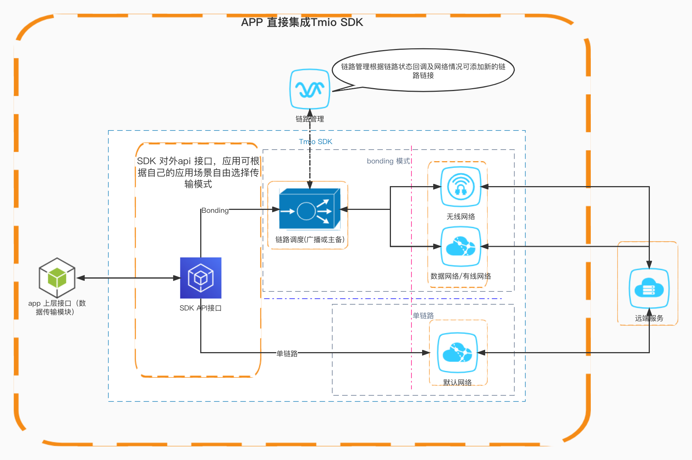

# Tmio 接入流程说明

[TOC]

----
## 简介

Tmio提供SRT流媒体传输协议封装、定制和优化，主要针对上行推流。

因当前广泛使用的推流协议是RTMP，产品中往往已经集成了RTMP的支持，Tmio暂不添加RTMP协议封装。用户仍然可通过RTMP over SRT的方式做接入，利用SRT的特性提升弱网表现。RTMP over SRT有两种接入方式：

1. 修改RTMP协议底层实现，用SRT做传输层
2. 通过TmioProxy代理方式，RTMP推流到本地代理，本地代理用SRT协议转发数据到服务端。对已有RTMP代码实现零侵入。注意TmioProxy只做双向数据透传，不做数据解析

* Tmio 架构

   |             tmio proxy 模式      |
   | :------------------------------: |
   |  |


   |          tmio 内部集成         |
   | :----------------------------: |
   |  |

----

## tmio 集成接入
* 相关API及接口说明详见`tmio.h`

### 推流示例
- tmio 推流接入流程

   |              tmio 接入流程                |
   | :----------------------------------------------------: |
   |  |

----

#### 创建Tmio&配置参数（代码示例）

```C++
        tmio_ = tmio::TmioFactory::createUnique(tmio::Protocol::SRT);
        tmio::SrtPreset::mpegTsLossless(tmio_.get());
        tmio_->setIntOption(tmio::srt_options::CONNECT_TIMEOUT, 4000);
        tmio_->setBoolOption(tmio::base_options::THREAD_SAFE_CHECK, true);
```

* 创建Tmio - 通过`TmioFactory`来创建

* 参数配置 - 根据不同参数选择不同的接口来实现配置
    * 参数名详见`tmio-option.h`
    * 简单配置可参考`tmio-preset.h`

```C++
//根据不同参数属性选择合适的配置
bool setBoolOption(const std::string &optname, bool value);

bool setIntOption(const std::string &optname, int64_t value);

bool setDoubleOption(const std::string &optname, double value);

bool setStrOption(const std::string &optname, const std::string &value);

...
```
----

#### 开始连接 （代码实例）
```C++
    /**
     * open the stream specified by url
     *
     * @param config protocol dependent
     */
    virtual std::error_code open(const std::string &url,
                                 void *config = nullptr) = 0;

```
- 单链路 (config 可为NULL)
  ```C++
    //默认单链路
    auto err = tmio->open(TMIO_SRT_URL);
    if (err) {
        LOGE("open failed, %d, %s", err.value(), err.message().c_str());
    }
  
  ```

- 多链路Bonding (当前仅支持SRT协议)
  - config 设置 (srt bonding 配置参数详见`tmio.h`文件 结构`SrtFeatureConfig`定义)
  ```C++
    tmio::SrtFeatureConfig option_;
    option_.protocol = tmio::Protocol::SRT;
    option_.trans_mode = tmio::SrtTransMode::SRT_TRANS_BACKUP;
    option_.addAvailableNet(net_name, local_addr, remote_url, 0, weight, -1);
  ```
  ```C++
    //bonding 多链路
    auto err = tmio_->open(TMIO_SRT_URL, &option_);
    if (err) {
        LOGE("open failed, %d, %s", err.value(), err.message().c_str());
    }
  
  ```
  -  对于多链路bonding open接口还可以用来对group组添加新的链路用于传输

----

#### 发送数据
```C++
    int ret = tmio_->send(buf.data(), datalen, err);
    if (ret < 0) {
        LOGE("send failed, %d, %s", err.value(), err.message().c_str());
        break;
    }
```

----

#### 接收数据
- 如果是需要交互的协议（如rtmp）， 此时需要启用接收接口来读取数据完成协议交互，这里提供两个接口调用
```c++
/**
 * receive data
 *
 * @param err return error details
 * @return number of bytes which were received, or < 0 to indicate error
 */
virtual int recv(uint8_t *buf, int len, std::error_code &err) = 0;

using RecvCallback = std::function<bool(const uint8_t *buf, int len, const std::error_code &err)>;
/**
 * receive data in event loop
 *
 * recvLoop() block current thread, receive data in a loop and pass the data to recvCallback
 * @param recvCallback return true to continue the receive loop, false for break
 */
virtual void recvLoop(const RecvCallback &recvCallback) = 0;
```

- 上层应用循环读取
  ```C++
    while (true) {
        ret = tmio_->recv(buf.data(), buf.size(), err);
        if (ret < 0) {
            LOGE("recv error: %d, %s", err.value(), err.message().c_str());
            break;
        }
        ...
    }
  ```

- 回调读取
  ```C++
    FILE *file = fopen(output_path, "w");
    tmio_->recvLoop([file](const uint8_t *buf, int len,
                              const std::error_code &err) {
        if (len < 0) {
            fwrite(buf, 1, len, file);
        } else if (len < 0) {
            LOGE("recv error: %d, %s", err.value(), err.message().c_str());
        }
        return true;
    });
  ```

----

#### 关闭Tmio
```C++
    tmio_->close();
```

----

#### 其他
- 获取当前链路状态 (应用可根据此状态信息调整推流策略)
```C++
    tmio::PerfStats stats_;
    tmio_->control(tmio::ControlCmd::GET_STATS, &stats_);
```

-----

## proxy 代理模式接入
* proxy相关API及接口说明详见`tmio-proxy.h`

### 接入流程
   |              proxy 接入流程                |
   | :----------------------------------------------------: |
   |  |


#### 创建TmioProxy

```c++
    std::unique_ptr<tmio::TmioProxy> proxy_ = tmio::TmioProxy::createUnique();
```

----

#### 设置监听

```c++
    void setListener(TmioProxyListener *listener);
```

TmioProxyListener监听接口如下：

1. Tmio配置回调，用户可在此回调内对Tmio做参数配置，**简单配置可使用`tmio-preset.h`提供的辅助方法**。

   ```c++
    /*
    void onTmioConfig(Tmio *tmio);
    */
    void onTmioConfig(tmio::Tmio *tmio) override {
        auto protocol = tmio->getProtocol();
        if (protocol == tmio::Protocol::SRT) {
            tmio::SrtPreset::rtmp(tmio);
        } else if (protocol == tmio::Protocol::RIST) {
            tmio->setIntOption(tmio::base_options::RECV_SEND_FLAGS,
                               tmio::base_options::FLAG_SEND);
        }
    }
   ```

2. TmioProxy启动回调：

   ```c++
    /*
    void onStart(const char *local_addr, uint16_t local_port); 
    */
    void onStart(const char *addr, uint16_t port) override {
        LOGFI("ip %s, port %" PRIu16, addr, port);
    }

   ```

   收到此回调代表连接远程服务器成功，并且TCP本地端口绑定成功，可以启动推流。

3. 错误信息回调

   ```c++
   /*
   void onError(ErrorType type, const std::error_code &err);
   */
    void onError(tmio::TmioProxyListener::ErrorType type,
                const std::error_code &err) override {
        LOGFE("error type %s, %s, %d", tmio::TmioProxyListener::errorType(type),
              err.message().c_str(), err.value());
    }
   ```

   用户可通过`ErrorType`来区分是本地IO错误还是远程IO错误。本地IO通常是RTMP推流主动触发的，如结束推流，一般可忽略，而远程IO错误一般不可忽略。

-----------

#### 启动代理

```c++
std::error_code start(const std::string &local_url, const std::string &remote_url, void * config=nullptr)
```
- 接口参数

  * `local_url`只支持tcp scheme，格式`tcp://${ip}:${port}`。port可以为0，为0时会绑定到随机端口，然后通过onStart()回调把绑定成功后的端口号返回给应用。使用0端口可以避免端口被占用、无权限等导致的绑定失败问题。
  * `remote_url`远程服务器url
  * `config` 配置参数，此参数当前仅在SRT BONDING 功能启用时使用，具体定义请依据tmio.h 下SrtFeatureConfig结构体定义

- 单链路（代码示例）
```C++
     proxy_->start(local_url, remote_url, NULL);
```

- bonding 多链路（代码示例）
```C++
    tmio::SrtFeatureConfig option;
    option_.protocol = tmio::Protocol::SRT;
    option_.trans_mode = tmio::SrtTransMode::SRT_TRANS_BACKUP;
    /*-----------------------------------------------------------*/
    {
        //根据当前需要建立的链路数可添加多个链路
        option_.addAvailableNet(net_name, local_addr, remote_url, 0, weight, -1);
    }
    /*-----------------------------------------------------------*/

     proxy_->start(local_url, remote_url, &option_);
```

----

#### 停止

```c++
    /*
    void stop();
    */
    proxy_.stop();
```
----

## Tmio Bonding 接入说明
- 详见[Tmio Bonding 集成说明](Tmio%20Bonding%20集成说明.md)
